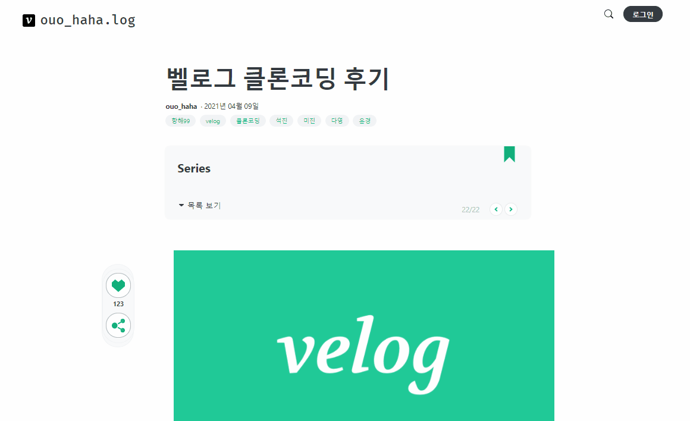
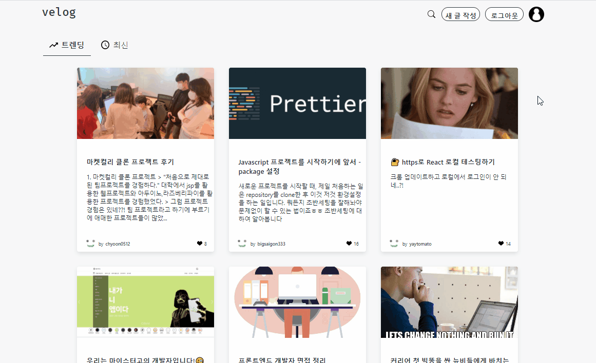
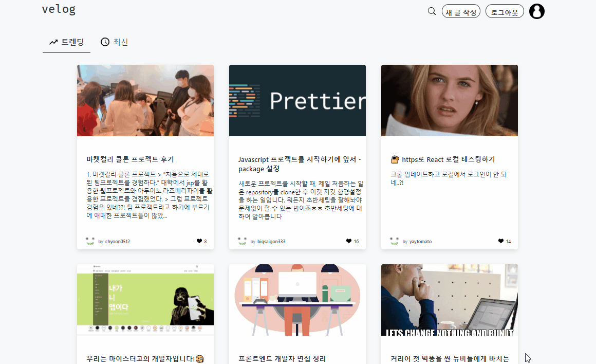
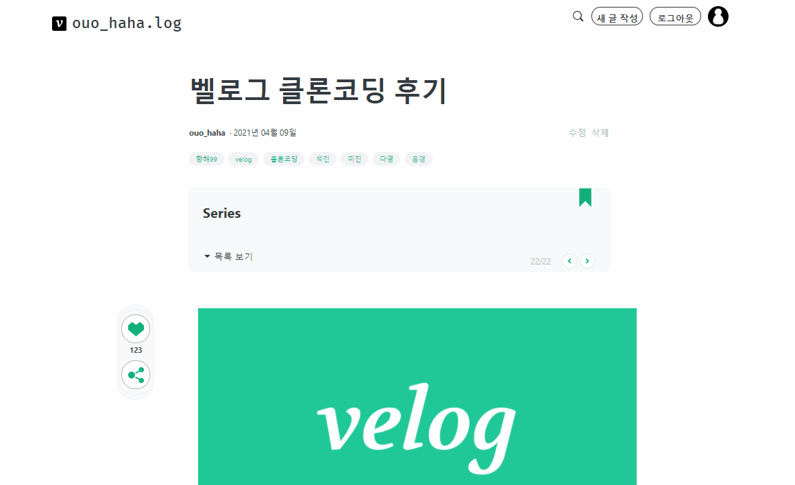

# hh99_clone

항해99 capter04 클론코딩 - velog

[영상으로 보러가기](https://www.youtube.com/watch?v=6VHe8WF6yf0)

```
개발 인원: 백앤드 2명 (강미진, 정석진) / 프론트엔드 2명 (김다영, 조윤경)
개발 기간: 2021.04.02 ~ 2021.04.08
```
# 목차

- [1. 주제](#주제)
- [2. stack](#stack)
- [3. 개발 환경](#개발환경)
- [4. 기능](#기능)
- [5. 동작화면](#동작화면)

<br>

## 주제

스프링부트와 리액트를 이용한 velog 클론코딩

<br>

## stack
- Backend: Java 8
- Frontend: react, redux, thunk, styled-component

<br>

## 개발환경
- Java: JDK 1.8
- IDE: IntelliJ
- DB : mySQL
- 빌드 관리 : Gradle
- 프레임워크: SpringBoot
> - ORM: Spring-Data-JPA
> - 보안 : Spring security
> - 형상 관리 툴 : git
> - Others: Lombok

<br>

## 기능

1. 게시글, 댓글 기본 CRUD 및 좋아요 기능
2. 회원가입 / JWT를 이용한 로그인 구현

<br>

## 동작화면

### 메인페이지


- 전체 목록조회
- 트렌딩, 최신 포스트 조회

### 상세페이지


### 로그인, 회원가입


### 글쓰기, 수정, 삭제

- 글쓰기


- 작성자만 수정, 삭제 가능

### 댓글 달기, 수정, 삭제


### 반응형

